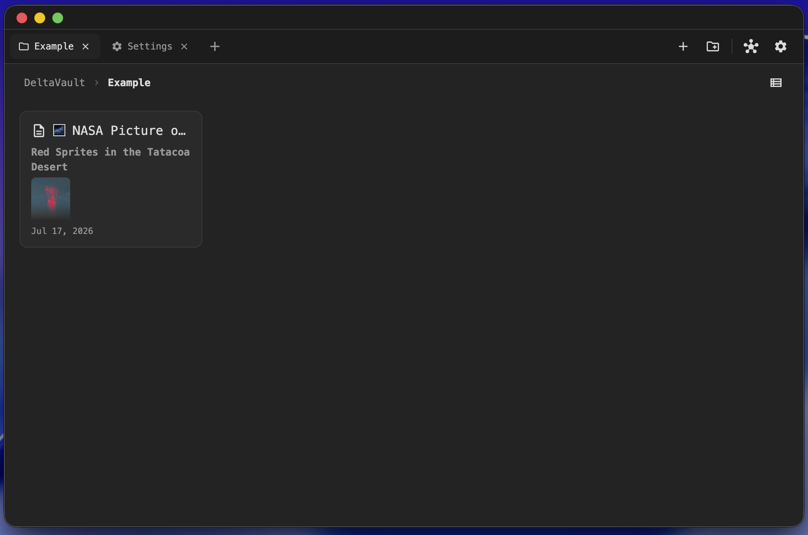
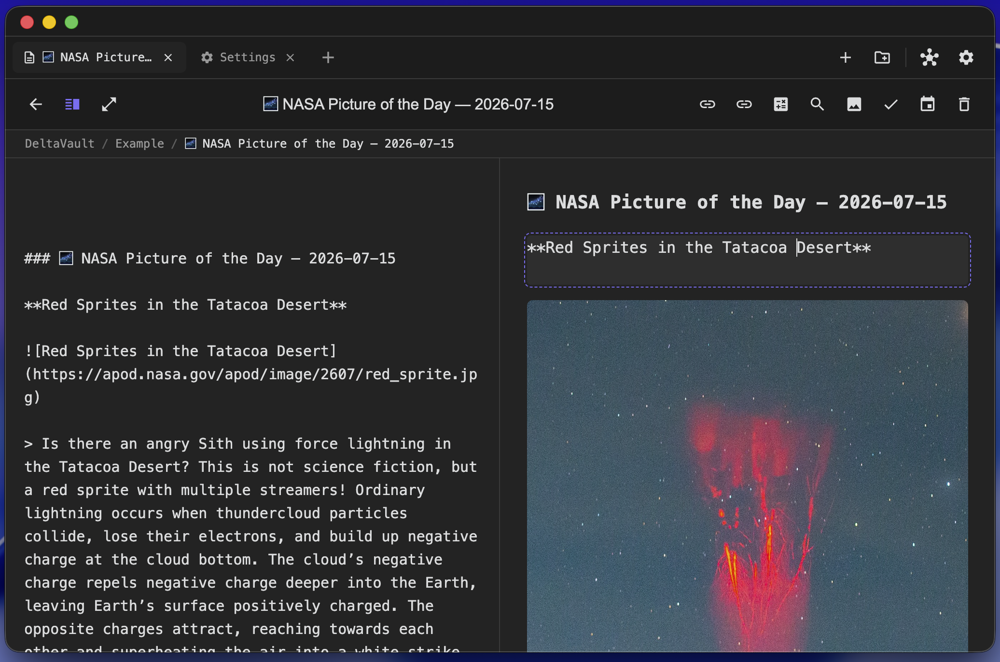
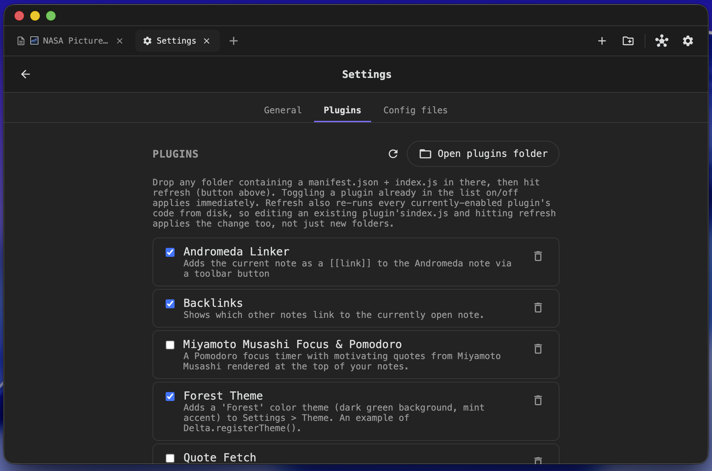

# Delta

A simple, fully hackable markdown notebook. Electron + Vite + React (JavaScript, no TypeScript).

You pick a folder ("vault") on your machine, and every note is a plain `.md` file inside it -
no database, no proprietary format.

## Screenshots

<p align="center">
  
</p>
<p align="center"><em>Notes grid - Keep-style cards, tabs, folders, graph view and settings one click away.</em></p>

<p align="center">
  
</p>
<p align="center"><em>Note editor - plain markdown with a live split preview (or full-screen preview).</em></p>

<p align="center">
  
</p>
<p align="center"><em>Plugins - drop a folder in, hit refresh, toggle it on. No restart needed.</em></p>

## Screens

1. **Vault select** - pick (or create) a folder to use as your vault.
2. **Notes** - a Google Keep-style card grid of every `.md` file in the vault, rendered as markdown.
   `+` creates a note, the hub icon opens Graph view, the gear icon opens Settings. No sidebar.
3. **Note editor** - a plain markdown textarea with two preview toggles: split view (editor + preview
   side by side) and full-screen preview (editor hidden). Renaming the title field renames the
   underlying `.md` file. Autosaves as you type.
4. **Graph view** - every note as a node, connected by `[[links]]`. Drag nodes, scroll to zoom, drag
   the background to pan. Click a node to open it (or create it, if it's only ever been linked to and
   never actually written).
5. **Settings** - switch theme (Material default, Nord, plus any plugin-registered ones), enable/disable
   plugins, open the plugins folder, change vault.

## Linking notes together

- `[[Note Name]]` or `[[Note Name|custom label]]` - a clickable link. Clicking it opens the note, or
  creates it (empty) if it doesn't exist yet.
- `![[Note Name]]` - an embed: renders that note's content inline, one level deep.
- Typing `[[` or `![[` in the editor pops up an autocomplete of matching note titles right at the
  caret (arrow keys + Enter/Tab to pick, Escape to dismiss).
- **Cmd/Ctrl+K** - quick switcher: search every note by title, or run New note / Graph view / Settings.
- **Cmd/Ctrl+F** - full-text search across every note's content, with a highlighted snippet per match.

## Plugins - the whole point of Delta

Plugins live in `<vault>/Delta/plugins/<plugin-id>/` as:

- `manifest.json` - `{ id, name, version, description, main }`
- `index.js` - plain JavaScript, no imports, no npm packages. It runs with full access to the global
  `Delta` API object (the same object the app itself uses), for example:

```js
Delta.registerPlugin({
  id: 'my-plugin',
  onLoad(api) {
    api.registerNoteToolbarButton({
      icon: 'Bolt',
      label: 'Do a thing',
      onClick(note) {
        api.showNotice(`Current note: ${note.title}`)
      }
    })
  }
})
```

See `plugins/example-word-count/` (adds a word-count button to the note toolbar) and
`plugins/example-forest-theme/` (registers a "Forest" color theme via `Delta.registerTheme()`)
for working examples. Both are copied into every vault automatically and can be toggled from Settings.

Other extension points: `Delta.registerSettingsSection()`, `Delta.registerMarkdownPlugin()` (extend the
markdown-it renderer), `Delta.registerTheme({ id, name, css })` (adds a new theme option at runtime),
a cursor/selection API (`Delta.insertAtCursor()` and friends), in-app `Delta.prompt()`/`Delta.confirm()`
dialogs, and the event bus `Delta.on(event, cb)` / `Delta.emit(event, payload)`. Full reference:
[`PLUGIN_API.md`](./PLUGIN_API.md).

Enabling/disabling a plugin in Settings applies immediately - no reopen or restart needed. A brand-new
plugin folder needs a click on the refresh icon next to "Open plugins folder" to show up in the list.

## Setup

```bash
pnpm install
pnpm dev         # runs Vite + Electron together, with hot reload
```

Production build:

```bash
pnpm build       # builds the renderer into dist/
pnpm start       # runs Electron against the built files
pnpm dist        # packages installers with electron-builder (output: release/)
```

## Contributing

Issues and pull requests are welcome. Delta is intentionally small and hackable - if your idea can be a
plugin (see [`PLUGIN_API.md`](./PLUGIN_API.md)), that is usually the best place for it. For anything
bigger, please open an issue first so we can talk it through.

## Security note

Plugins run with full access to the app and the vault (no sandbox, by design). Only install plugins
whose code you have read and trust.

## License

[MIT](./LICENSE) © 2026 Delta contributors
